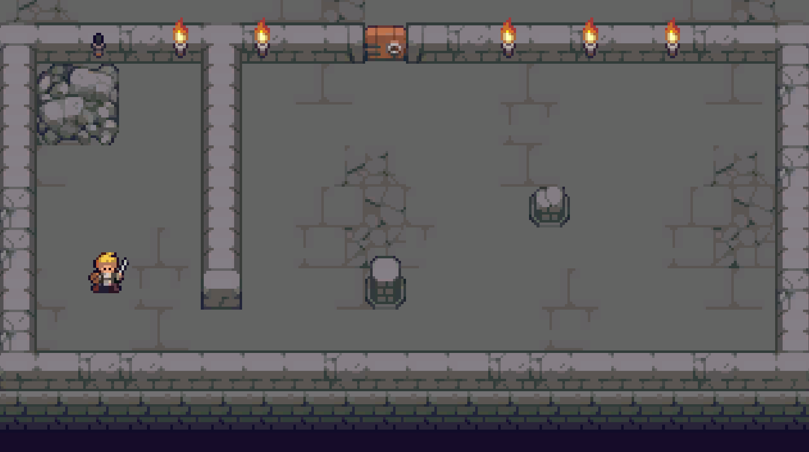

# Top Down RPG Test

This is just a test project I use for helping me teach some concepts.

* Top-down RPG (Zelda-like) framework, with movement and attack
* Enemies that can take damage and die
* Pseudo flashlight using a mesh that simulates shadows
  
There are depth issues that are Unity's fault (don't like how they support this type 
of maps, but haven't explored many solutions for that so far).

## License

* All source code used is licensed under the [MIT license](LICENSE).
* Art assets by [Pita], bought through Humble Bundle - Not for free use!

## Metadata

* Autor: [Diogo Andrade]

[Diogo Andrade]:https://github.com/DiogoDeAndrade
[Pita]:https://silverdeluxe.tumblr.com/about
